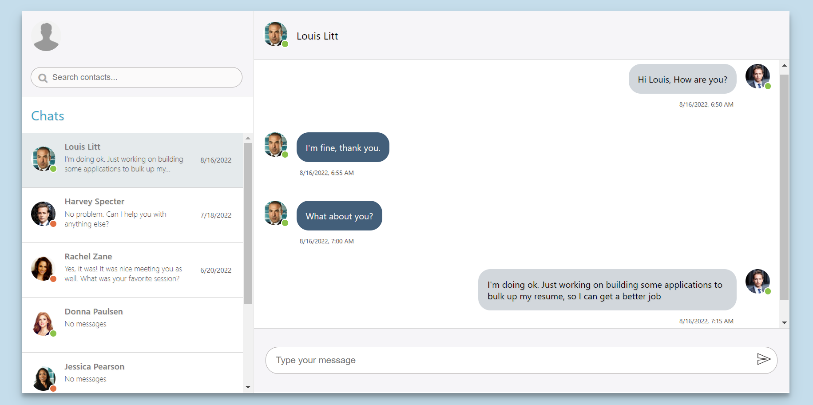

<div align="center">
	<br>
	<h1>React Chat App</h1>
</div>

<!-- PROJECT SHIELDS -->
<div align="center">

   
   
   
   
   
   

</div>

<!-- ABOUT THE PROJECT -->
## About The Project

React Chat App is a web application whose main purpose is to show users how chat works in real time. When a user opens this application for the first time, it already contains a static contact list and chat history with some users. 
A user has the ability to write a message to the chat and, after sending it, receive an automatic response after a while. The data for the automatic response is generated from the API. Also, the application implements a search for contacts. And what is very important, the application saves the history of messages after reloading the page.



<!-- LIVE DEMO -->
## Live Demo

Live demo URL: https://react-autoresponse-chat-app.herokuapp.com/

Note: the demo app is running on heroku free hosting, so server availability cannot be guaranteed.

## Built With

* [React](https://reactjs.org/)
* [React Redux](https://react-redux.js.org/)
* [Redux Toolkit](https://redux-toolkit.js.org/)
* [Redux Persist](https://github.com/rt2zz/redux-persist)
* [Axios](https://axios-http.com/)
* [HTML](https://developer.mozilla.org/en-US/docs/Web/HTML)
* [Sass](https://sass-lang.com/)

<!-- GETTING STARTED -->
## Getting Started

### Prerequisites

* [Git](https://git-scm.com)
* [Node.js](https://nodejs.org/en/download/)
* [npm](http://npmjs.com)

### Installation

```sh
# Step 1: Clone the repository
$ git clone https://github.com/RadyaBen/React-Chat-App.git

# Step 2: Go into the repository
$ cd React-Chat-App

# Step 3: Install NPM packages
$ npm install

# Step 4: Run the app
$ npm start
```